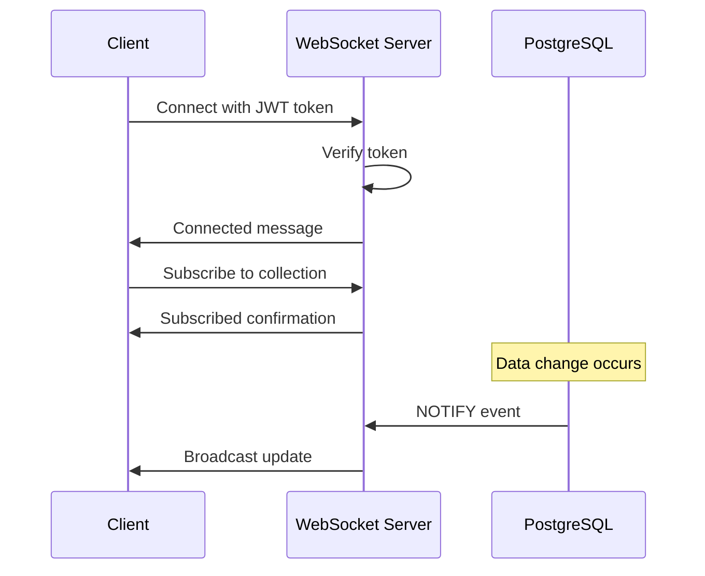

# WebSocket API Documentation

## Overview

The WebSocket API provides real-time updates for database changes. Clients can subscribe to specific collections and receive notifications when data is created, updated, or deleted.

## Connection

### Endpoint
```
ws://localhost:3000/ws
```

### Authentication

The WebSocket connection requires a valid JWT token. You can provide the token in two ways:

1. **Query Parameter** (Recommended for Flutter):
```
ws://localhost:3000/ws?token=YOUR_JWT_TOKEN
```

2. **Authorization Header**:
```
Authorization: Bearer YOUR_JWT_TOKEN
```

### Connection Flow



## Message Types

### Client to Server

#### 1. Subscribe to Collection
```json
{
  "type": "subscribe",
  "collection": "appointments"
}
```

**Valid Collections:**
- `appointments`
- `patients`
- `procedures`
- `stock_items`
- `expenses`
- `operators`

**Response:**
```json
{
  "type": "subscribed",
  "collection": "appointments",
  "message": "Subscribed to appointments updates"
}
```

#### 2. Unsubscribe from Collection
```json
{
  "type": "unsubscribe",
  "collection": "appointments"
}
```

**Response:**
```json
{
  "type": "unsubscribed",
  "collection": "appointments",
  "message": "Unsubscribed from appointments updates"
}
```

#### 3. Ping
```json
{
  "type": "ping"
}
```

**Response:**
```json
{
  "type": "pong"
}
```

### Server to Client

#### 1. Connection Established
```json
{
  "type": "connected",
  "message": "WebSocket connection established",
  "clinicId": "550e8400-e29b-41d4-a716-446655440000"
}
```

#### 2. Data Update Notification
```json
{
  "type": "update",
  "collection": "appointments",
  "action": "created",
  "data": {
    "id": "123e4567-e89b-12d3-a456-426614174000",
    "patientName": "John Doe",
    "dateTime": "2024-12-17T10:00:00Z",
    ...
  }
}
```

**Actions:**
- `created` - New record added
- `updated` - Record modified
- `deleted` - Record removed

#### 3. Error
```json
{
  "type": "error",
  "message": "Error description"
}
```

## Example Usage

### Flutter (Dart)

```dart
import 'package:web_socket_channel/web_socket_channel.dart';
import 'dart:convert';

class WebSocketService {
  IOWebSocketChannel? _channel;
  
  void connect(String token) {
    _channel = IOWebSocketChannel.connect(
      Uri.parse('ws://localhost:3000/ws?token=$token')
    );
    
    // Listen to messages
    _channel!.stream.listen(
      (message) {
        final data = jsonDecode(message);
        handleMessage(data);
      },
      onError: (error) {
        print('WebSocket error: $error');
      },
      onDone: () {
        print('WebSocket connection closed');
      },
    );
  }
  
  void subscribe(String collection) {
    _channel?.sink.add(jsonEncode({
      'type': 'subscribe',
      'collection': collection,
    }));
  }
  
  void handleMessage(Map<String, dynamic> data) {
    switch (data['type']) {
      case 'connected':
        print('Connected to WebSocket');
        break;
      case 'update':
        print('${data['action']} on ${data['collection']}');
        // Update local state
        break;
      case 'error':
        print('Error: ${data['message']}');
        break;
    }
  }
  
  void disconnect() {
    _channel?.sink.close();
  }
}
```

### JavaScript

```javascript
const ws = new WebSocket('ws://localhost:3000/ws?token=YOUR_JWT_TOKEN');

ws.onopen = () => {
  console.log('Connected to WebSocket');
  
  // Subscribe to appointments
  ws.send(JSON.stringify({
    type: 'subscribe',
    collection: 'appointments'
  }));
};

ws.onmessage = (event) => {
  const data = JSON.parse(event.data);
  
  if (data.type === 'update') {
    console.log(`${data.action} on ${data.collection}`, data.data);
    // Update UI
  }
};

ws.onerror = (error) => {
  console.error('WebSocket error:', error);
};

ws.onclose = () => {
  console.log('WebSocket connection closed');
};
```

## Error Codes

| Code | Description |
|------|-------------|
| 1008 | Authentication required or invalid token |
| 1000 | Normal closure |

## Security

- JWT token is verified on connection
- Clients can only receive updates for their own clinic (multi-tenancy enforced)
- Subscription is filtered by clinic membership
- Rate limiting applies to connection attempts

## Performance

- Each clinic has a separate subscription group
- Updates are only sent to subscribed clients
- PostgreSQL LISTEN/NOTIFY is used for efficient change detection
- Supports horizontal scaling with shared PostgreSQL NOTIFY

## Monitoring

Check WebSocket statistics via the health endpoint:

```http
GET /health
```

Response includes WebSocket stats:
```json
{
  "success": true,
  "message": "Server is running",
  "timestamp": "2024-12-16T10:00:00.000Z",
  "websocket": {
    "totalClients": 5,
    "clinics": {
      "clinic-id-1": 3,
      "clinic-id-2": 2
    }
  }
}
```

## Troubleshooting

### Connection Fails

1. **Check token validity**
   - Token must be valid and not expired
   - Token must include `userId` and `clinicId` claims

2. **Check server logs**
   - Look for authentication errors
   - Check if WebSocket service initialized

3. **Check network**
   - Ensure WebSocket port (3000) is accessible
   - Check firewall settings

### Not Receiving Updates

1. **Verify subscription**
   - Send subscribe message for the collection
   - Check for subscription confirmation

2. **Check clinic membership**
   - Updates are only sent for your clinic's data
   - Verify `clinicId` in JWT token

3. **Test connection**
   - Send ping message, expect pong response
   - Check WebSocket connection status

## Best Practices

1. **Reconnection Logic**
   - Implement exponential backoff for reconnection attempts
   - Resubscribe to collections after reconnection

2. **Heartbeat**
   - Send periodic ping messages to keep connection alive
   - Typical interval: 30-60 seconds

3. **Error Handling**
   - Handle all message types including errors
   - Gracefully degrade to polling if WebSocket fails

4. **Resource Management**
   - Close WebSocket when app goes to background
   - Unsubscribe from collections when not needed

5. **State Synchronization**
   - Fetch initial data via REST API
   - Use WebSocket only for updates
   - Handle missed updates during disconnection

